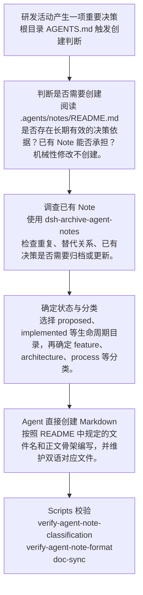

```mermaid
flowchart TD
    A["研发活动产生一项重要决策<br/>根目录 AGENTS.md 触发创建判断"]
  
    B["判断是否需要创建<br/>阅读 .agents/notes/README.md<br/>是否存在长期有效的决策依据？已有 Note 能否承担？机械性修改不创建。"]
  
    C["调查已有 Note<br/>使用 dsh-archive-agent-notes<br/>检查重复、替代关系、已有决策是否需要归档或更新。"]
  
    D["确定状态与分类<br/>选择 proposed、implemented 等生命周期目录，再确定 feature、architecture、process 等分类。"]
  
    E["Agent 直接创建 Markdown<br/>按照 README 中规定的文件名和正文骨架编写，并维护双语对应文件。"]
  
    F["Scripts 校验<br/>verify-agent-note-classification<br/>verify-agent-note-format<br/>doc-sync"]

    A --> B
    B --> C
    C --> D
    D --> E
    E --> F
```
